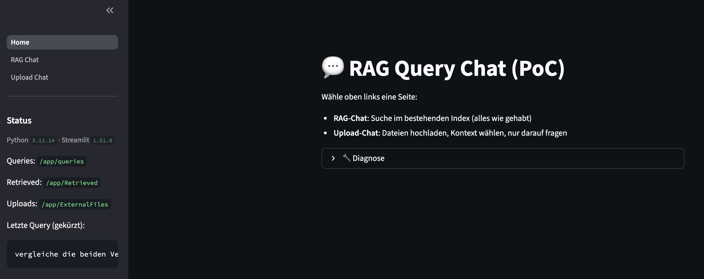

# POC eines RAG System – DSGVO-konforme Vertragsanalyse

Dieses Projekt ist ein **Retrieval-Augmented Generation (RAG) System**, das auf **Streamlit** basiert und vollständig **DSGVO-konform** arbeitet.  
Es ermöglicht sowohl die **Analyse** als auch den **interaktiven Chat** mit hochgeladenen Dokumenten – lokal oder containerisiert via **Docker**.

---

## 📸 Übersicht



Die Startseite bietet zwei Hauptfunktionen:

- **📤 Upload Chat:** Hochladen und Verarbeiten von Dokumenten  
- **💬 RAG Chat:** Semantische Suche und Konversation über eingebettete Inhalte  

---

## 🎥 Demo-Videos

**RAG Chat**  
[▶️ Rag_Chat.mov](demo/Rag_Chat.mov)

**Upload Chat**  
[▶️ UploadChat.mov](demo/UploadChat.mov)

---

## ⚙️ Architektur & Features

- **Frontend:** Streamlit (Multi-Page App mit moderner UI)
- **Backend:** Python mit modularer Struktur (`RAG_POC.py`, `SectionBuilder.py`, `UploadAnswer.py`)
- **Embeddings & Retrieval:** Azure Cognitive Search / OpenAI Embeddings  
- **Dokumentenverarbeitung:** Azure Document Intelligence (OCR & Strukturierung)
- **Datenschutz:** DSGVO-konform durch lokale oder private Cloud-Verarbeitung
- **Containerisierung:** Lauffähig in Docker oder via Docker Compose
- **Erweiterbarkeit:** Sauber getrennte Module, leicht erweiterbar um neue Pipelines oder Modelle

---

## 🛠️ Technik (Wie das RAG funktioniert)

### 1) Import & OCR
- **Quelle:** Dateien aus `./Input` (`.pdf`, `.png`, `.jpg`, `.tif` …).  
- **OCR:** Asynchroner Batch mit `azure.ai.documentintelligence.aio.DocumentIntelligenceClient` (`prebuilt-read`), gesteuert über `MAX_CONCURRENCY=10`.  

### 2) Chunking & Headings
- **Tokenizer-basierte Chunking-Engine** (`chunk_tokenwise_with_line_snap`):  
  - Zielgröße ~800 Tokens, Overlap ~100, weich auf **Zeilenanfänge** und **Satzenden** “snappen”.  
  - Erkennung von **§-Überschriften** (Regex), die als zusätzliche Headings pro Chunk mitgeführt werden.  
- Ergebnis: Liste `(heading, text)`-Paare je Dokument; persistiert in `./Result`.

### 3) Metadaten-Extraktion (Low-Context, Vertragstitel/-kopf)
- **LLM-gestützt (Azure OpenAI, GPT-4.1-nano):**  
  - Extrahiert robuste Felder wie `property_code`, `unit_codes`, `street`, `house_no`, `postal_code`, `city`, `tenant`, `start_date`, `fixed_term_end`.  
  - Nutzt **nur** die ersten 1–2 Sections (Kopf/Präambel) zur Minimierung von Halluzinationen; normalisiert Schreibweisen (z. B. `WE 03.12`).

### 4) Embeddings & Indexierung
- **Embeddings:** Azure OpenAI (`text-embedding-3-small`, 1536 Dimensionen).  
- **Azure AI Search Index (`chunks`):**  
  - Felder: `id`, `doc_id`, `chunk_no`, `heading`, `content`, `meta{...}`, `embedding`.  
  - **VectorSearch:** HNSW + Profil `vprof`.  
  - **Semantic Search:** Konfiguration `default` mit `heading` als `title_field`, `content` als `content_fields` und priorisierten Keywordfeldern aus `meta` (z. B. `meta/property_code`, `meta/city`, `meta/unit_codes` …).  
  - IDs & Keys werden **sicher normalisiert** (Umlaute → `ae/oe/ue`, `ß` → `ss`, erlaubte Zeichen).

### 5) Retrieval (Hybrid + Reranker)
- **Query-Pipeline:**  
  1. Erzeuge Query-Embedding.  
  2. **Hybrid-Search** in Azure AI Search: `search_text=query` (BM25) **+** `vector_queries=[embedding]`.  
  3. **Semantic Reranker** (QueryType `SEMANTIC`, Config `default`) sortiert Ergebnisse.  
  4. **per_doc_cap** begrenzt Treffer pro `doc_id` (Standard: 3), um **Streusätze** zu vermeiden.  
  5. (Optional) **Meta-Filter**: iterativer, feldbasierter Substring-Match über `meta` (z. B. Straße, PLZ, `unit_codes`).

### 6) Antwortgenerierung (Grounded QA)
- **Kontextformatierung:** Nummerierte Auszüge `[rank]` inkl. Quelle (`doc_id`), Heading, optional Seitenangaben.  
- **LLM (Azure OpenAI, GPT-5-nano):**  
  - Systemprompt erzwingt **Quellenbelege** `[ #rank ]` und **pure Kontexttreue** (“Wenn unklar, sag es explizit”).  
  - `reasoning_effort="low"` und `max_completion_tokens` kontrollierbar.  
- **Speicherung:** Der **User Prompt** wird in `./userPrompt/prompt.txt` abgelegt (Revisions-/Audit-Zwecke).

### 7) Steuerung & Betriebsmodi
- **K & Capping:** `K` (Top-K), `topK0` (Server-Recall), `per_doc_cap` (Diversität) sind expose-bar.

### 8) DSGVO & Sicherheit
- **Keine personenbezogenen Daten nach außen**: Alle Schritte können lokal/privat laufen.  
- **.env-basierte Konfiguration**: Keys/Endpoints via `dotenv` geladen; **keine Secrets im Code/Repo**.  
- **Sanitizing & Limits**: Payload-Capping, saubere Filenamen, robuste Fehlerbehandlung im Async-Pfad.

> **Genutzte Services**  
> - **Azure Document Intelligence** (OCR, `prebuilt-read`)  
> - **Azure OpenAI** (Embeddings & Chat/Completion für Meta-Extraktion und Antworten)  
> - **Azure AI Search** (Hybrid Retrieval, Vektorindex, Semantic Reranking)  
> - **Streamlit** (Frontend)

---

## 🚀 How To Run

### 🔧 Voraussetzungen
- Docker & Docker Compose installiert  
- `.env` Datei mit den benötigten API Keys und Einstellungen vorhanden, wie in .env_template

### 📂 Vorbereitung
1. Lege deine zu analysierenden Dateien im Ordner `Input/` ab.  
2. Optional: Überprüfe oder passe die Mounts in `docker-compose.yml` an.  

### ▶️ Start mit Docker Compose

```bash
docker-compose up --build
